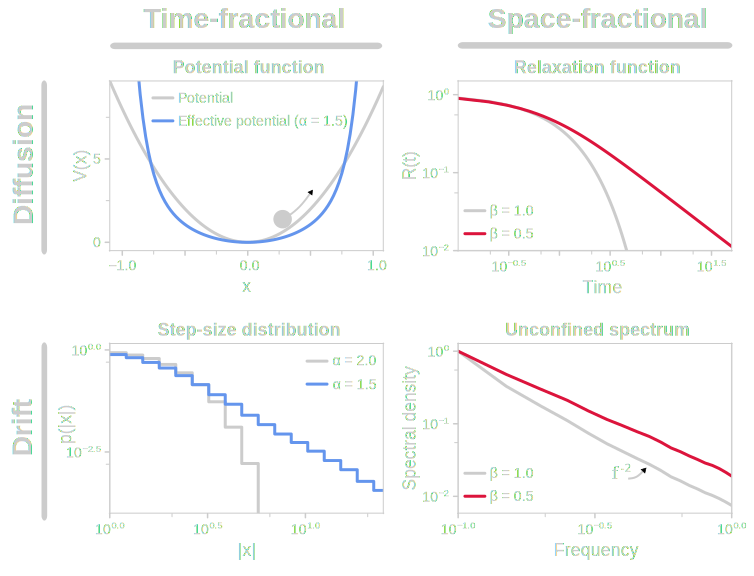
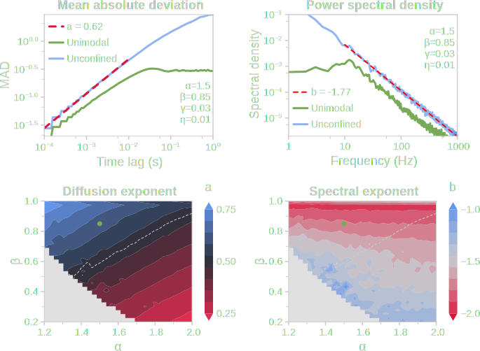
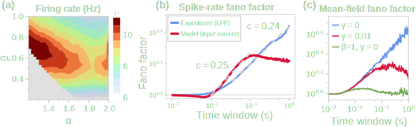

# The Adaptive Fractional Regime of Visual Cortex

**Brendan Harris & Pulin Gong**

School of Physics The University of Sydney

[brendanjohnharris.github.io/WorkingRegimeSlides](https://brendanjohnharris.github.io/WorkingRegimeSlides)

---

# What is the working regime of the visual cortex?

Spontaneous activity is fluctuation-driven

- Low firing rates (~1--10 Hz) [[Barth & Poulet 2012](https://doi.org/10.1016/j.tins.2012.03.008)]
- Sparse coding [[Olshausen & Field 2004](https://doi.org/10.1016/j.conb.2004.07.007)]
- Mean membrane potentials far from threshold [[Carandini 2000](https://doi.org/10.1523/JNEUROSCI.20-01-00470.2000); [DeWeese & Zador 2006](https://doi.org/10.1523/jneurosci.2813-06.2006)]

But also highly variable and non-stationary

- Nested oscillations and $1/f$ [[Poil et al. 2012](https://doi.org/10.1523/JNEUROSCI.5990-11.2012)]
- Super-Poissonian spikes [[Churchland et al. 2010](https://doi.org/10.1038/nn.2501)]
- Bumpy synaptic inputs [[Okun & Lampl 2008](https://doi.org/10.1038/nn.2105)]

<!-- 
Allen Institute Neuropixels dataset — 53 sessions, 36 mice, 6 visual areas
 -->

<!-- 
How do we understand the origin of these dynamics?
 -->

---

# Classical model: balanced-state network

**Balanced E/I populations** can produce the fluctuation-driven regime [[van Vreeswijk & Sompolinsky 1996](https://doi.org/10.1126/science.274.5293.1724)]

**Mean-field theory** treats summed E/I input as a stochastic process [[Brunel 2000](https://doi.org/10.1023/A:1008925309027)]:
- E and I inputs cancel on average
- Spiking is driven by fluctuations alone
<!-- - Population oscillations from E-I feedback appear in input traces -->
<!-- ; [Wardak & Gong 2021](https://doi.org/10.1103/PhysRevResearch.3.013083)] -->

Classical mean-field Langevin-like Equation

$$\frac{dV}{dt} = f(V) + \eta\,\xi(t)$$

where $\xi(t)$ is white (or OU) Gaussian noise.

---

# Dynamical exponents

<!-- The choice of Gaussian noise **is not neutral** — it locks in specific dynamical exponents -->

Diffusion

MAD (width of probability density) expands $\propto \tau^a$ with $a = 0.5$

Spectral

PSD $\propto f^b$ with $b = -2$, indicating local temporal correlations

But experiment and circuit models show anomalous exponents that contradict these values

---

# How do we capture anomalous dynamics?

**Bi-fractional mean-field input**

$${}^C\!D_t^{\textcolor{#DC143C}{\beta}}\, x = -\eta\,\nabla \tilde{V}_{\textcolor{#6495ED}{\alpha}} + {\textcolor{#EF9901}{\gamma}}\, p + \eta^{1/{\textcolor{#6495ED}{\alpha}}}\,\xi_{{\textcolor{#6495ED}{\alpha}},{\textcolor{#DC143C}{\beta}}}$$

$$\frac{dp}{dt} = -{\textcolor{#EF9901}{\gamma}}\,\nabla \tilde{V}_{\textcolor{#6495ED}{\alpha}}$$

$\textcolor{#6495ED}{\alpha}$ — Space-fractional order

Heavy-tailed jumps → superdiffusion

$\textcolor{#DC143C}{\beta}$ — Time-fractional order

Power-law memory → long-range correlations

$\textcolor{#EF9901}{\gamma}$ — Momentum coupling

Local oscillations

---

# What do fractional derivatives do?

  

| | **Space-fractional** $\alpha$ | **Time-fractional** $\beta$ |
| --- | --- | --- |
| **Classical limit** | $\textcolor{#6495ED}{\alpha} = 2$: Gaussian | $\textcolor{#DC143C}{\beta} = 1$: finite memory |
| **Fractional regime** | $1 < \textcolor{#6495ED}{\alpha} < 2$ | $0 < \textcolor{#DC143C}{\beta} < 1$ |
| **Drift effect** | Effective potential with steep walls | Caputo derivative produces power-law relaxation|
| **Diffusion effect** | Stable distribution produces large jumps, promotes superdiffusion | Long-range memory flattens power spectrum, promotes subdiffusion |

---

# bFNS: tunable diffusion and spectral exponents

  

**Diffusion exponent $a$** depends on $\textcolor{#6495ED}{\alpha}$ and $\textcolor{#DC143C}{\beta}$
- $\textcolor{#6495ED}{\alpha} \downarrow \textrm{pushes } a \uparrow$ (superdiffusive)
- $\textcolor{#DC143C}{\beta} \downarrow \textrm{pushes } a \downarrow$ (subdiffusive)

 

**Spectral exponent $b$** is only sensitive to $\textcolor{#DC143C}{\beta}$
- $\textcolor{#DC143C}{\beta} \downarrow \textrm{pushes } b \uparrow$ (more long-range temporal dependencies)

 

$\textcolor{#EF9901}{\gamma}$ adds oscillatory peak

 

**Experimental targets:**
- $b \approx -1.7 \to \textcolor{#6495ED}{\alpha} \approx 1.5$
- $a \approx 0.6 \to \textcolor{#DC143C}{\beta} \approx 0.85$

---

# bFNS an an empirical mean field

$\textcolor{#6495ED}{\alpha}$ superdiffusion enhances fluctuation-driven regime (lower mean $V$ for a given firing rate)

$\textcolor{#DC143C}{\beta}$ memory increases firing-rate variability and produces power-law Fano factor scaling................add fano factor for experiment here.................

$\textcolor{#EF9901}{\gamma}$ momentum adds subthreshold oscillations, tempering Fano factor scaling

  

---

# Summary: the adaptive fractional state

Experiment + circuit model

Visual cortex shows anomalous scaling:

$a > 0.5$ | $b > -2$ | $c > 0$

Inconsistent with Gaussian mean-field

bFNS model

Fractional calculus gives tunable exponents:

$\textcolor{#6495ED}{\alpha}$ superdiffusion   $\textcolor{#DC143C}{\beta}$ long-range memory   $\textcolor{#EF9901}{\gamma}$ oscillations

Independent control over anomalous dynamics

Functional implication

Competition between superdiffusion and subdiffusion:

Exploration vs Exploitation

Navigates the flexibility–stability trade-off

bFNS provides a mechanistic bridge between anomalous **circuit dynamics** and **population statistics**

---

<h1>Future directions</h1>

<h1>Thank you!</h1>

Saccadic eye movements

Jude Metcalf — Heavy-tailed saccade dynamics modelled via bFNS

Decision making

Aiden Sloots — Fractional drift-diffusion with heavy tails and memory

Hierarchical exponents

Exponent variation across visual areas, layers, and E/I balance

Theta--gamma coupling

Jude Metcalf -- Interactions between adaptation and momentum

Machine learning and sampling efficiency

Bayesian inference via heavy-tailed, memory-driven sampling

**Brendan Harris** & Pulin Gong

School of Physics, University of Sydney

<!--  -->

<a href="mailto:brendan.harris@sydney.edu.au" class="flex items-center gap-2 !border-none"><carbon-email class="w-4 h-4 inline" /> brendan.harris@sydney.edu.au</a>
<a href="https://github.com/brendanjohnharris" class="flex items-center gap-2 !border-none"><carbon-logo-github class="w-4 h-4 inline" /> brendanjohnharris</a>
<a href="https://bsky.app/profile/brendanjohnharris.bsky.social" class="flex items-center gap-2 !border-none"><carbon-logo-bluesky class="w-4 h-4 inline" /> @brendanjohnharris</a>
 

<a href="https://brendanjohnharris.github.io/WorkingRegimeSlides/" class="">Slide deck</a>

---
layout: center
class: supplementary
---

# Supplementary slides

---
class: supplementary
---

# S1: exponent variation across hierarchy

Diffusion, spectral, and variability exponents across layers and areas

Figure: Exponents across cortical layers and visual areas

- Trend toward decreased diffusion exponent in layer 2/3 across hierarchy
- Higher areas show spectral exponents closer to $-1.5$
- Variability exponent increases in higher areas

---
class: supplementary
---

# S2: input distribution parameters

Distribution of stable distribution parameters across neurons

Figure: Stable distribution parameters across neurons

- Tail index $\approx 1.5$
- Skewness $\approx 0$ (symmetric)
- Scale and location parameters vary across neurons

---
class: supplementary
---

# S3: sampling accuracy

bFNS maintains accurate sampling across parameter space

**Unimodal potential**

Accuracy heatmap

**Bimodal potential**

Accuracy heatmap

Low Wasserstein distance between target and empirical distributions

---
class: supplementary
---

# S4: circuit model parameters

**Neuron parameters**
- $C = 0.25$ nF
- $g_L^E = 0.0167$ μS
- $V_L = -70$ mV
- $V_{\mathrm{th}} = -50$ mV
- $\tau_K = 40$ ms
- $\Delta g_K = 0.002$ μS

**Synaptic parameters**
- $\tau_r^E = 1.0$ ms
- $\tau_d^E = 5.0$ ms
- $V_E = 0$ mV
- $V_I = -80$ mV

**Connectivity**
- $\rho = 20000$ /mm²
- $L = 0.5$ mm
- E:I ratio $= 4$
- $\eta_{EE} = 0.06$ mm
- $K_{EE} = 260$
- $J_{EE} = 0.00105$ μS

**External input**
- $\nu_{\mathrm{ext}} = 10$ Hz
- $n_{\mathrm{ext}} = 100$

